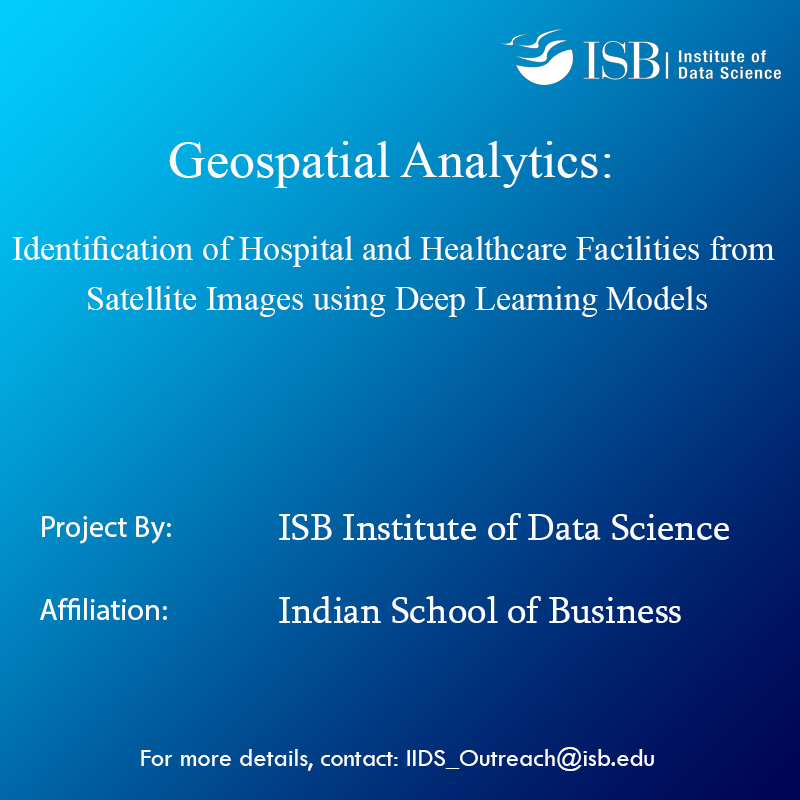

## **Contributors:** Dr. Shruti Mantri, Gokul S Kumar, Vishal Siram  
## **Faculty Mentors:** Dr. Manish Gangwar, Dr. Madhu Vishwanathan.

 

## Aim & Objective
To design and develop an intelligent system that identifies hospitals and healthcare facilities from satellite images.

## Steps involved
1. Collecting the names of major cities in Maharashtra.
2. Using Google Maps API to get the addresses of hospitals in these cities, including their coordinates.
3. Using Mapbox API to get the aerial images for the collected coordinates of hospital buildings.
4. Use CVAT Online to annotate these images with the help of Google Earth Pro.
5. Convert the annotations in XML files to binary masks.
6. Split the data into Urban and Rural areas, and then into train and test sets.
7. Split the train data into train and validation data and train the UNet model.
8. Use the model weights to make predictions.

Use the "requirements.txt" file to clone the environment in which the model eas developed.

## Repo contents
- **input**: The address (and coordinates) CSV's from Google Maps API, the image files from Mapbox and the respective annotation XML files from CVAT.
- **models**: The final model weights.
- **notebooks**: Jupyter notebooks used for data visualization and other purposes.
- **src**: All the python scripts associated with the project.
- **inference**: Contains the geotiff infra maps, tile numbers containing infrastructure, images used for inference & predictions in .npz and geojson format.

